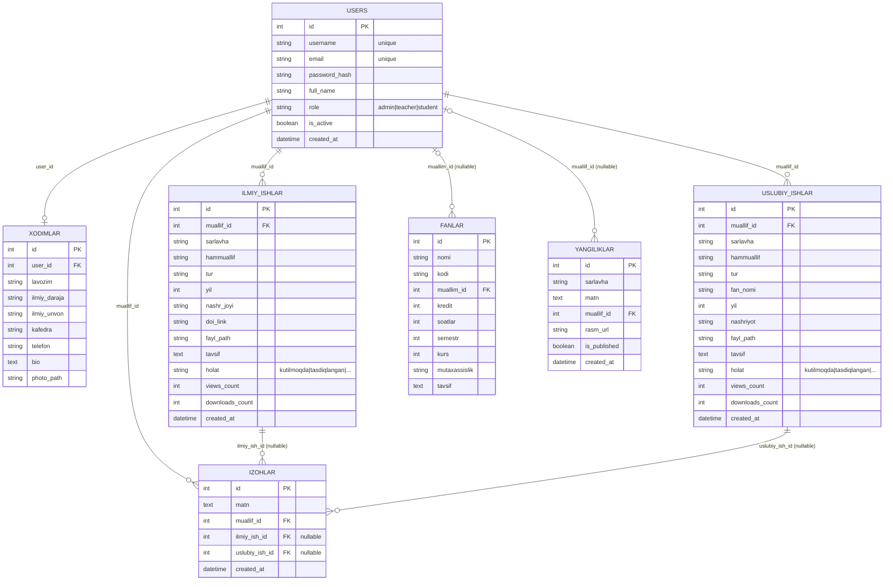
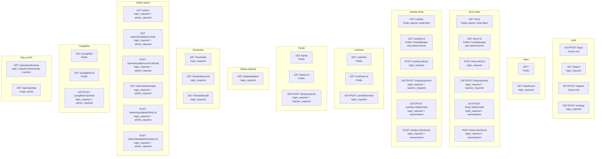
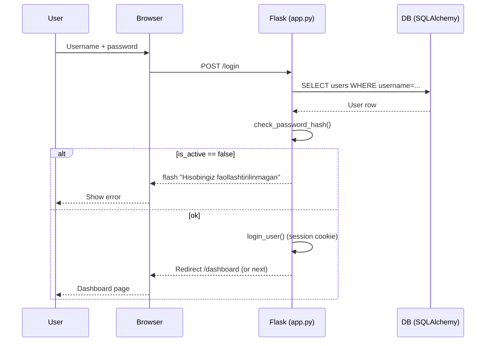
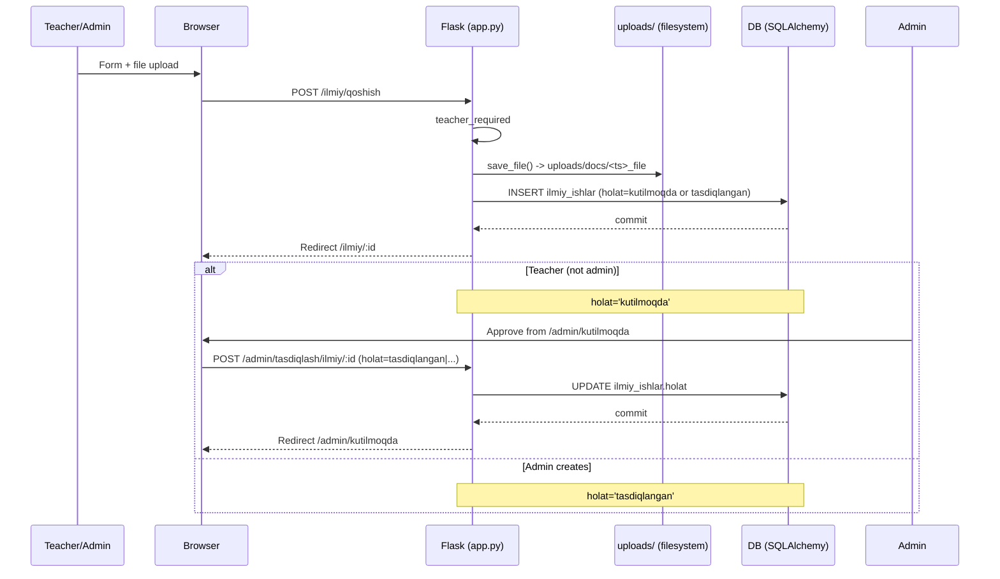
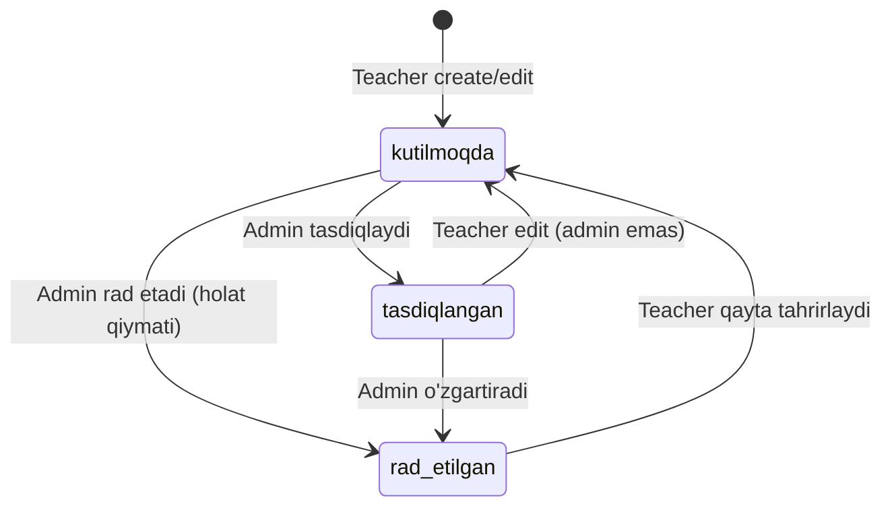
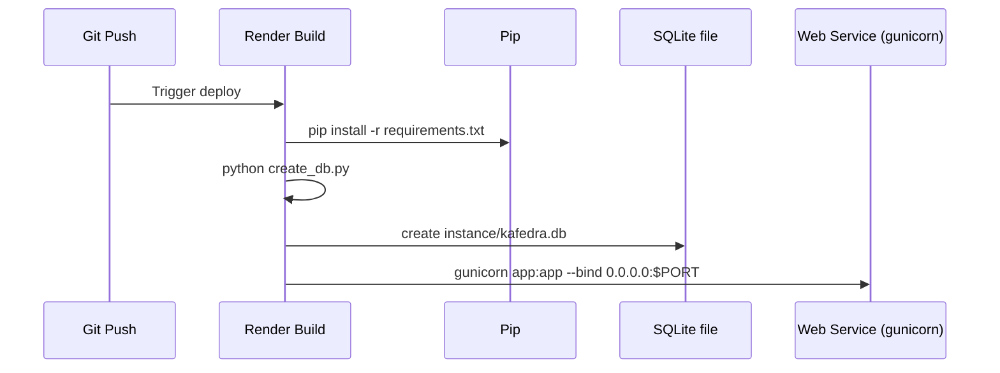

# Kafedra ilmiy-uslubiy tizimi - Mermaid diagrammalar

Quyidagi diagrammalar loyiha strukturasi va `app.py`/`models.py` dagi real kod oqimlariga moslab tuzilgan.

## 1) Umumiy arxitektura (komponentlar)

```mermaid
flowchart LR
  subgraph Users[Users]
    Guest[Guest]
    Student[Student]
    Teacher[Teacher]
    Admin[Admin]
  end

  Browser[Browser]
  Guest --> Browser
  Student --> Browser
  Teacher --> Browser
  Admin --> Browser

  Browser -->|HTTP| Flask[Flask app\n(app.py)]
  Flask --> Templates[Templates\n(Jinja2)]
  Flask --> Static[Static assets\n(Bootstrap 5, CSS/JS, SVG)]

  Flask -->|ORM| DB[(SQLAlchemy DB)]
  DB -->|sqlite file| SqliteFile[instance/kafedra.db]
  DB -->|optional| Postgres[(PostgreSQL via DATABASE_URL)]

  Flask --> Uploads[(File storage\nuploads/)]
  Uploads --> Docs[uploads/docs/*]
  Uploads --> Photos[uploads/photos/*]

  Flask --> ExportExcel[Excel export\n(openpyxl)]
  Flask --> ExportPDF[PDF export\n(reportlab)]
```

## 2) Ma'lumotlar bazasi (ERD)

> `Izoh` polymorphic: izoh ilmiy yoki uslubiy ishga bog'lanishi mumkin (ikkalasidan bittasi).



## 3) Router xaritasi (endpointlar + ruxsatlar)



## 4) Login oqimi (sequence)



## 5) Ilmiy ish qo'shish + admin tasdiqlashi (sequence)



## 6) Holat state diagram (Ilmiy/Uslubiy)



## 7) Render deploy oqimi


